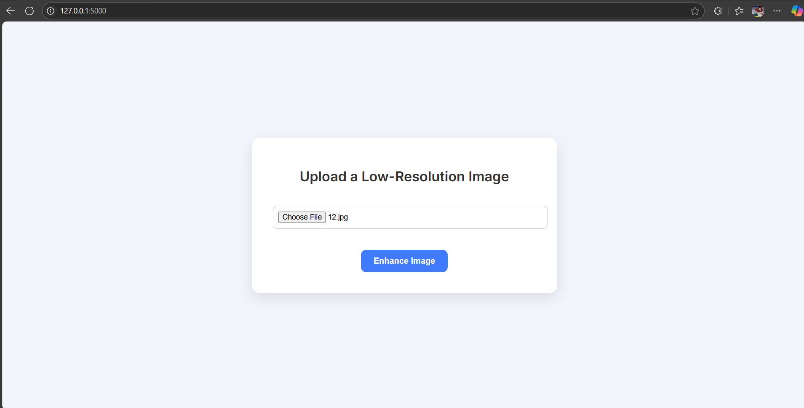
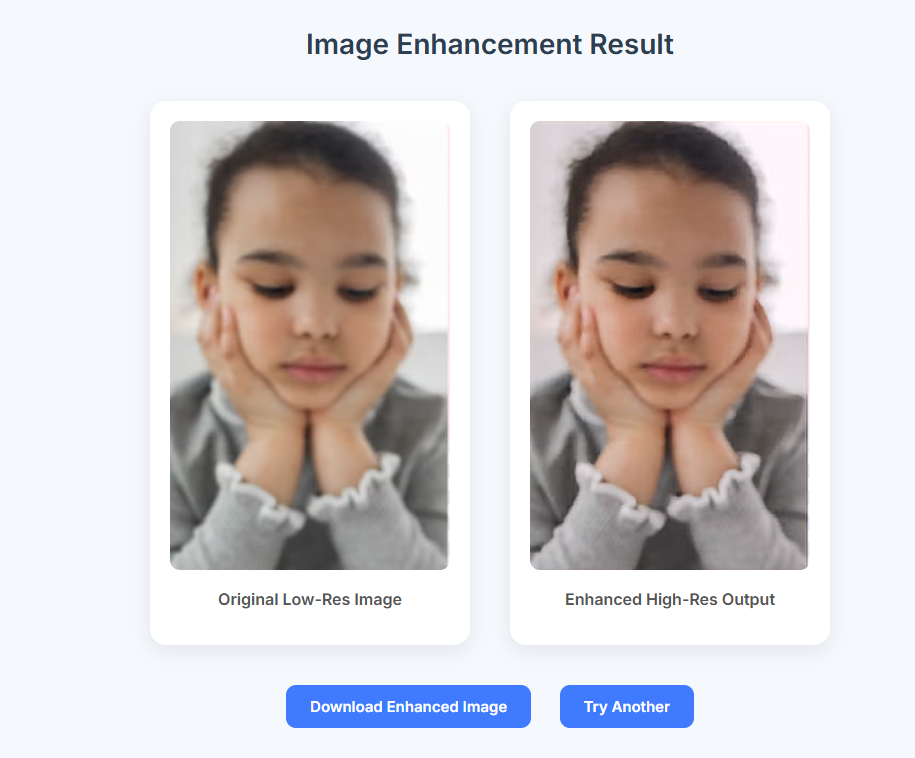
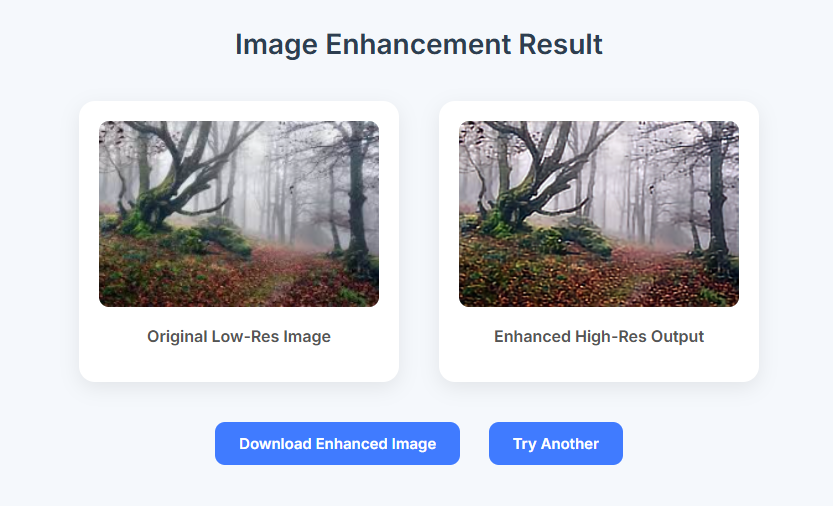
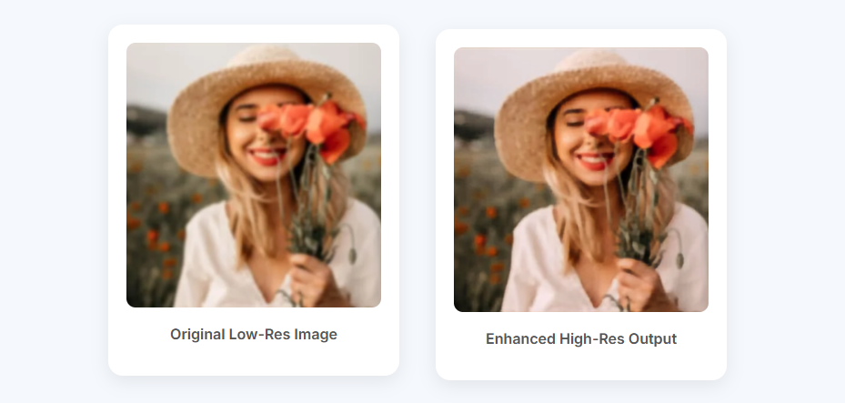

# 🔍 Image Sharpening using Knowledge Distillation

This project demonstrates image super-resolution (sharpening) using a **Knowledge Distillation** approach, where a large **teacher model (EDSR)** guides a smaller, efficient **student model (EDSR-baseline)** to perform high-quality image upscaling.

## 📌 Project Objective

To build a lightweight super-resolution model that can upscale low-resolution images using knowledge distillation from a more powerful teacher model, and deploy it using a **Flask web application**.

---

## 🖼️ Web App 

### 🔹 Upload Page

---

### 🔹 Result Page

** Enhanced Images ** 

## 🧠 Models Used

| Role     | Model Name      | Architecture Details                       |
|----------|------------------|--------------------------------------------|
| Teacher  | `EDSR`           | 16 residual blocks, 64 channels            |
| Student  | `EDSR_baseline`  | 4 residual blocks, 32 channels             |

> 📐 Both models use bicubic upsampling with a scale factor of `4x`.

---
## 📊 Evaluation Metrics

| Metric | Value  |
|--------|--------------------------------------------|
| 🟦 PSNR (Peak Signal-to-Noise Ratio) | 25.55 dB |
| 🟩 SSIM (Structural Similarity Index) | 0.7305 |

---

## 🛠️ Tech Stack

- Python
- PyTorch
- Flask
- HTML/CSS 
- Matplotlib / Pillow
- TorchVision

---

## 🚀 Web Application (Flask)

# 1. Clone the repository
git clone https://github.com/PoojithaGatta/Image_sharpening.git
cd Image_sharpening

# 2. Install dependencies
pip install -r requirements.txt

# 3. Run the Flask App
python app.py

Go to http://127.0.0.1:5000 and upload a low-resolution image to get the sharpened super-resolution output.

---

### 👥 Collaborators

- Poojitha Gatta  
- Abhinaya Chalamalsetty  
- Ubbarapu Siri
